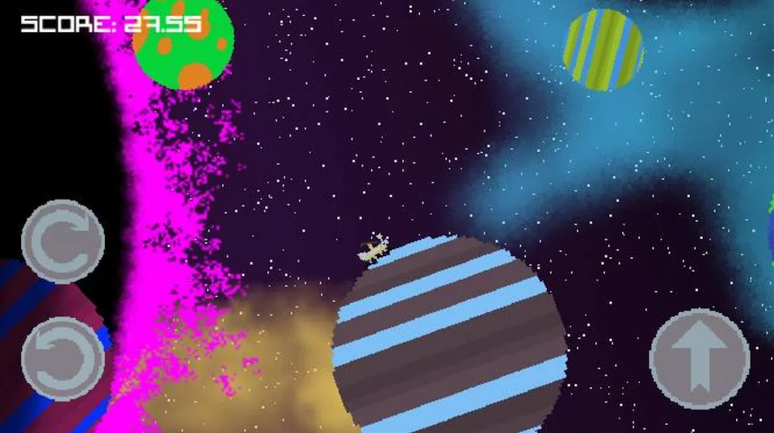

Moon Hopper was a game that I made for mobile (Android) devices.
It was an infinite 2D runner that used planets instead of traditional platforms. I had to utilize object pooling and create artificial gravity for each planet.

